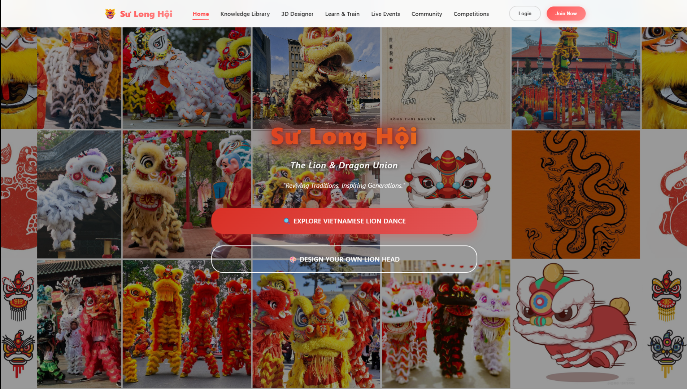

<div align="center">
  
  
  # 🏮 Sư Long Hội
  
  **Preserving Vietnamese Traditional Performing Arts Through Digital Innovation**
  
  [](https://reactjs.org/)
  [](https://vitejs.dev/)
  [](LICENSE)
  
  *A comprehensive cultural-tech platform dedicated to preserving and promoting Vietnam's rich heritage of lion dance (múa lân) and dragon dance traditions through digital design, interactive education, and vibrant community connection.*
  
  
</div>

---

## 🎭 About SuLongHoi

Sư Long Hội is an innovative platform that bridges the gap between traditional Vietnamese performing arts and modern digital technology. Our mission is to preserve, teach, and celebrate the ancient art forms of lion and dragon dance that have been integral to Vietnamese culture for over eight centuries.

### ✨ What Makes Us Special

-   **🏮 Cultural Preservation**: Digitally documenting and preserving traditional lion and dragon dance techniques, history, and regional variations
-   **🎓 Interactive Learning**: Comprehensive educational resources with video tutorials, technique guides, and gamified learning experiences
-   **🎨 3D Design Tools**: Revolutionary 3D designer for creating and customizing traditional lion and dragon costumes
-   **🌟 Community Hub**: Vibrant marketplace and social platform connecting artists, performers, and cultural enthusiasts
-   **🏆 Competitions & Events**: Live streaming competitions and cultural events to showcase talent and preserve traditions

---

## 🚀 Features

### 📚 Knowledge Library

-   **150+ Articles & Guides** covering history, techniques, and cultural significance
-   **50+ Video Tutorials** with master performers and cultural experts
-   **25+ Historical Documents** preserving ancient texts and traditions
-   **100+ Cultural Stories** celebrating the rich mythology and legends

### 🎨 3D Costume Designer

-   Interactive 3D modeling tools for lion and dragon head designs
-   Traditional pattern libraries and customization options
-   Real-time preview and rendering capabilities
-   Export functionality for 3D printing and manufacturing

### 🎓 Learn & Train Platform

-   Structured learning paths from beginner to master level
-   Regional style variations (Northern, Central, Southern Vietnam)
-   Progress tracking and achievement badges
-   Live training sessions with certified masters

### 🌐 Community Features

-   **Marketplace**: Buy/sell authentic costumes, accessories, and performance bookings
-   **Social Wall**: Share performances, tips, and cultural insights
-   **Stories Section**: Community-contributed cultural narratives and experiences

### 🏆 Events & Competitions

-   Live streaming of traditional festivals and competitions
-   Virtual performance showcases
-   Cultural workshops and masterclasses
-   International cultural exchange programs

---

## 🛠️ Technology Stack

-   **Frontend**: React 18.2.0 with modern hooks and context
-   **Build Tool**: Vite 4.0.0 for lightning-fast development
-   **Routing**: React Router DOM for seamless navigation
-   **Styling**: Custom CSS with modern design systems and responsive layouts
-   **Architecture**: Component-based modular architecture
-   **Performance**: Optimized for fast loading and smooth animations

---

## 📁 Project Structure

```
SuLongHoi-platform/
├── src/
│   ├── components/           # Reusable UI components
│   │   ├── common/          # Button, Card, SectionTitle
│   │   ├── layout/          # Navbar, Footer
│   │   └── sections/        # Homepage sections
│   ├── pages/               # Main application pages
│   │   ├── Home.jsx         # Landing page
│   │   ├── KnowledgePage.jsx # Knowledge library
│   │   └── ArticlePage.jsx   # Article reader
│   ├── styles/              # Organized CSS architecture
│   │   ├── base/           # Variables, global styles
│   │   ├── components/     # Component-specific styles
│   │   ├── layout/         # Layout component styles
│   │   ├── pages/          # Page-specific styles
│   │   └── sections/       # Section component styles
│   ├── assets/
│   │   └── images/         # Logos, illustrations, icons
│   ├── hooks/              # Custom React hooks
│   └── utils/              # Constants and helper functions
├── public/                 # Static assets
└── docs/                   # Documentation files
```

---

## 🚀 Quick Start

### Prerequisites

-   Node.js (v16 or higher)
-   npm or yarn package manager

### Installation

1. **Clone the repository**

    ```bash
    git clone https://github.com/Bright-04/SuLongHoi-platform.git
    cd SuLongHoi-platform
    ```

2. **Install dependencies**

    ```bash
    npm install
    ```

3. **Start development server**

    ```bash
    npm run dev
    ```

4. **Open your browser**
   Navigate to `http://localhost:5173` to see the application

### Available Scripts

-   `npm run dev` - Start development server with hot reload
-   `npm run build` - Build production-ready application
-   `npm run preview` - Preview production build locally

---

## 🎯 Roadmap

### Phase 1: Foundation (Current)

-   [x] Core platform architecture
-   [x] Knowledge library with articles and tutorials
-   [x] Basic 3D costume designer
-   [x] Community marketplace foundation
-   [x] Responsive design implementation

### Phase 2: Enhancement (Next)

-   [ ] Advanced 3D modeling capabilities
-   [ ] Video streaming integration
-   [ ] User authentication and profiles
-   [ ] Mobile application development
-   [ ] Multilingual support (Vietnamese, English, Chinese)

### Phase 3: Expansion (Future)

-   [ ] AI-powered dance movement analysis
-   [ ] Virtual Reality training experiences
-   [ ] International cultural exchange platform
-   [ ] Advanced analytics and insights
-   [ ] Blockchain-based cultural asset verification

---

## 🌟 Cultural Impact

### Preserving Heritage

-   **8+ Centuries** of documented lion dance history
-   **3 Regional Styles** comprehensively covered
-   **Traditional Techniques** preserved through digital media
-   **Master Knowledge** transferred to new generations

### Educational Outreach

-   **Schools Integration**: Educational modules for Vietnamese cultural studies
-   **International Awareness**: Promoting Vietnamese culture globally
-   **Accessibility**: Making traditional arts accessible to diaspora communities
-   **Documentation**: Creating permanent digital archives

---

## 🤝 Contributing

We welcome contributions from cultural enthusiasts, developers, and community members! Here's how you can help:

### For Developers

1. Fork the repository
2. Create a feature branch (`git checkout -b feature/amazing-feature`)
3. Commit your changes (`git commit -m 'Add amazing feature'`)
4. Push to the branch (`git push origin feature/amazing-feature`)
5. Open a Pull Request

### For Cultural Experts

-   Share traditional knowledge and techniques
-   Provide historical documentation and stories
-   Review content for cultural accuracy
-   Contribute to the knowledge library

### For Community Members

-   Report bugs and suggest improvements
-   Share feedback on user experience
-   Contribute cultural stories and experiences
-   Help with translation and localization

---

## 📝 License

This project is licensed under the MIT License - see the [LICENSE](LICENSE) file for details.

---

## 🙏 Acknowledgments

-   **Vietnamese Cultural Masters** who shared their knowledge and expertise
-   **Traditional Artisans** who preserve authentic costume-making techniques
-   **Community Contributors** who help document and share cultural stories
-   **Open Source Community** for the amazing tools and libraries

---

## 📞 Contact & Support

-   **Website**: [SuLongHoi Platform](https://sulonghoi.com)
-   **Email**: contact@sulonghoi.com
-   **GitHub**: [@Bright-04](https://github.com/Bright-04)

---

<div align="center">
  
  
  **"Preserving the past, inspiring the future"**
  
  *Building bridges between traditional Vietnamese culture and modern technology*
</div>Sư Long Hội - cultural-tech platform to preserve and promote Vietnam’s lion and dragon dance heritage through digital design, education, and community connection.
